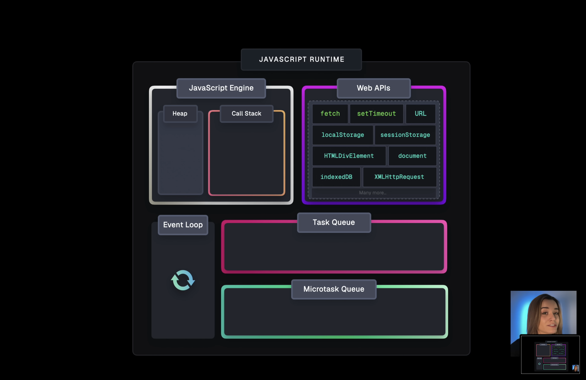

# Event Loop Interview Prep



---

## 📘 Key Notes

### Event Loop Basics
- JS is single-threaded → uses **call stack + event loop** to manage async code.
- **Call stack**: runs synchronous code line by line.
- **Queues**: hold async callbacks until stack is free.

### Types of Queues
- **Microtask Queue**
  - `Promise.then`, `queueMicrotask`, `process.nextTick` (Node).
  - Runs **right after current stack**, before macrotasks.
- **Macrotask Queue**
  - `setTimeout`, `setInterval`, `setImmediate` (Node), I/O callbacks.
  - Runs **after all microtasks are cleared**.

### Order of Execution
1. Sync code → call stack.
2. `process.nextTick` (Node only).
3. Microtasks (Promises, `queueMicrotask`).
4. Macrotasks (Timers → setTimeout, setInterval).
5. `setImmediate` (Node → check phase).

### Node.js vs Browser
- **Browser**: microtasks (Promises, queueMicrotask) → then macrotasks (setTimeout).
- **Node.js**:
  - `process.nextTick` runs **before** Promise microtasks.
  - Event loop phases: timers → pending → idle → poll → check (setImmediate) → close.
  - `setTimeout(...,0)` often runs before `setImmediate` in scripts.

### Common Traps
- Promises inside Promises create **nested microtasks**.
- Microtasks can queue more microtasks (chained `.then`).
- In Node.js, `process.nextTick` can starve the event loop if abused.
- Inside a macrotask (like `setTimeout`), microtasks still run **before the next macrotask**.

---

## 📝 Practice Questions

### Q1 (Browser)
```js
console.log("Start");

setTimeout(() => {
  console.log("setTimeout");
}, 0);

Promise.resolve().then(() => {
  console.log("Promise 1");
}).then(() => {
  console.log("Promise 2");
});

console.log("End");
```

### Q2 (Browser)
```js
console.log("A");

setTimeout(() => {
  console.log("B");
}, 0);

Promise.resolve().then(() => {
  console.log("C");
  setTimeout(() => {
    console.log("D");
  }, 0);
});

console.log("E");
```

### Q3 (Browser)
```js
console.log("1");

setTimeout(() => {
  console.log("2");
}, 0);

Promise.resolve().then(() => {
  console.log("3");
  return Promise.resolve("4");
}).then(res => {
  console.log(res);
});

console.log("5");
```

### Q4 (Node.js)
```js
console.log("X");

setTimeout(() => {
  console.log("Y");
}, 0);

setImmediate(() => {
  console.log("Z");
});

process.nextTick(() => {
  console.log("W");
});

console.log("Q");
```

### Q5 (Node.js)
```js
console.log("1");

setTimeout(() => {
  console.log("2");
}, 0);

setImmediate(() => {
  console.log("3");
});

process.nextTick(() => {
  console.log("4");
});

Promise.resolve().then(() => {
  console.log("5");
});

console.log("6");
```

### Q6 (Browser)
```js
console.log("Start");

setTimeout(() => {
  console.log("Timeout 1");
}, 0);

Promise.resolve().then(() => {
  console.log("Promise 1");
  setTimeout(() => {
    console.log("Timeout 2");
  }, 0);
}).then(() => {
  console.log("Promise 2");
});

queueMicrotask(() => {
  console.log("Microtask A");
});

console.log("End");
```

### Q7 (Browser)
```js
console.log("1");

setTimeout(() => {
  console.log("2");
  Promise.resolve().then(() => console.log("3"));
}, 0);

Promise.resolve().then(() => {
  console.log("4");
  setTimeout(() => console.log("5"), 0);
});

console.log("6");
```

### Q8 (Browser Nested Promises)
```js
console.log("1");

Promise.resolve().then(() => {
  console.log("2");
  Promise.resolve().then(() => {
    console.log("3");
    return Promise.resolve("4");
  }).then(res => console.log(res));
}).then(() => console.log("5"));

console.log("6");
```

### Q9 (Browser Nested Promises)
```js
console.log("A");

Promise.resolve().then(() => {
  console.log("B");
  Promise.resolve().then(() => console.log("C")).then(() => console.log("D"));
}).then(() => console.log("E"));

console.log("F");
```

### Q10 (Browser Retry)
```js
console.log("1");

Promise.resolve().then(() => {
  console.log("2");
  Promise.resolve().then(() => console.log("3")).then(() => console.log("4"));
}).then(() => console.log("5"));

console.log("6");
```

### Q11 (Browser Microtask + Promise)
```js
console.log("Start");

Promise.resolve().then(() => {
  console.log("A");
  queueMicrotask(() => console.log("B"));
  Promise.resolve().then(() => console.log("C")).then(() => console.log("D"));
}).then(() => console.log("E"));

queueMicrotask(() => console.log("F"));

console.log("End");
```

### Q12 (Browser Final Boss)
```js
console.log("A");

setTimeout(() => {
  console.log("B");
  Promise.resolve().then(() => console.log("C"));
  queueMicrotask(() => console.log("D"));
}, 0);

Promise.resolve().then(() => {
  console.log("E");
  queueMicrotask(() => console.log("6"));
  Promise.resolve().then(() => console.log("7")).then(() => console.log("8"));
}).then(() => console.log("9"));

queueMicrotask(() => console.log("10"));

console.log("I");
```

### Q13 (Node Complex)
```js
console.log("1");

setTimeout(() => {
  console.log("2");
  process.nextTick(() => console.log("3"));
}, 0);

setImmediate(() => console.log("4"));

Promise.resolve().then(() => console.log("5"));

console.log("6");
```

### Q14 (Node Complex)
```js
console.log("A");

setTimeout(() => {
  console.log("B");
  Promise.resolve().then(() => console.log("C"));
  process.nextTick(() => console.log("D"));
}, 0);

setImmediate(() => console.log("E"));

Promise.resolve().then(() => {
  console.log("F");
  setTimeout(() => console.log("G"), 0);
  setImmediate(() => console.log("H"));
}).then(() => console.log("I"));

process.nextTick(() => console.log("J"));

console.log("K");
```

### Q15 (Node Hardcore)
```js
console.log("1");

setTimeout(() => {
  console.log("2");
  Promise.resolve().then(() => console.log("3")).then(() => console.log("4"));
  process.nextTick(() => console.log("5"));
}, 0);

setImmediate(() => {
  console.log("6");
  process.nextTick(() => console.log("7"));
  Promise.resolve().then(() => console.log("8"));
});

Promise.resolve().then(() => {
  console.log("9");
  setImmediate(() => console.log("10"));
}).then(() => console.log("11"));

process.nextTick(() => console.log("12"));

console.log("13");
```

---

## ⚡ Rapid Fire Questions

### RF1 (Browser)
```js
console.log("A");
setTimeout(() => console.log("B"), 0);
Promise.resolve().then(() => console.log("C"));
console.log("D");
```

### RF2 (Node.js)
```js
console.log("1");
setImmediate(() => console.log("2"));
process.nextTick(() => console.log("3"));
Promise.resolve().then(() => console.log("4"));
console.log("5");
```

### RF3 (Browser)
```js
console.log(1);
setTimeout(() => console.log(2), 0);
Promise.resolve().then(() => {
  console.log(3);
  setTimeout(() => console.log(4), 0);
}).then(() => console.log(5));
console.log(6);
```

### RF4 (Node.js)
```js
console.log(1);
setTimeout(() => console.log(2), 0);
setImmediate(() => console.log(3));
process.nextTick(() => console.log(4));
Promise.resolve().then(() => console.log(5));
console.log(6);
```

### RF5 (Browser)
```js
console.log(1);
Promise.resolve().then(() => {
  console.log(2);
  return Promise.resolve();
}).then(() => console.log(3));
queueMicrotask(() => console.log(4));
console.log(5);
```

### RF6 (Node.js)
```js
console.log(1);
setTimeout(() => {
  console.log(2);
  process.nextTick(() => console.log(3));
}, 0);
setImmediate(() => console.log(4));
Promise.resolve().then(() => console.log(5));
console.log(6);
```

### RF7 (Browser)
```js
console.log(1);
setTimeout(() => console.log(2), 0);
Promise.resolve().then(() => {
  console.log(3);
  Promise.resolve().then(() => console.log(4));
}).then(() => console.log(5));
console.log(6);
```

### RF8 (Node.js)
```js
console.log(1);
setImmediate(() => {
  console.log(2);
  process.nextTick(() => console.log(3));
});
setTimeout(() => console.log(4), 0);
Promise.resolve().then(() => console.log(5));
console.log(6);
```

### RF9 (Browser)
```js
console.log(1);
queueMicrotask(() => console.log(2));
Promise.resolve().then(() => console.log(3)).then(() => console.log(4));
console.log(5);
```

### RF10 (Node.js)
```js
console.log(1);
process.nextTick(() => console.log(2));
setTimeout(() => console.log(3), 0);
Promise.resolve().then(() => console.log(4));
setImmediate(() => console.log(5));
console.log(6);
```

### RF11 (Browser)
```js
console.log(1);
setTimeout(() => {
  console.log(2);
  Promise.resolve().then(() => console.log(3));
}, 0);
Promise.resolve().then(() => {
  console.log(4);
  setTimeout(() => console.log(5), 0);
});
console.log(6);
```

### RF12 (Node.js)
```js
console.log(1);
setImmediate(() => console.log(2));
setTimeout(() => {
  console.log(3);
  process.nextTick(() => console.log(4));
}, 0);
Promise.resolve().then(() => console.log(5));
console.log(6);
```

### RF13 (Browser)
```js
console.log(1);
Promise.resolve().then(() => {
  console.log(2);
  return Promise.resolve();
}).then(() => {
  console.log(3);
  queueMicrotask(() => console.log(4));
}).then(() => console.log(5));
console.log(6);
```

## ✅ Answers

### Practice Answers
- **Q1**
```
Start
End
Promise 1
Promise 2
setTimeout
```
- **Q2**
```
A
E
C
B
D
```
- **Q3**
```
1
5
3
4
2
```
- **Q4**
```
X
Q
W
Y
Z
```
- **Q5**
```
1
6
4
5
2
3
```
- **Q6**
```
Start
End
Promise 1
Microtask A
Promise 2
Timeout 1
Timeout 2
```
- **Q7**
```
1
6
4
2
3
5
```
- **Q8**
```
1
6
2
3
5
4
```
- **Q9**
```
A
F
B
E
C
D
```
- **Q10**
```
1
6
2
5
3
4
```
- **Q11**
```
Start
End
A
F
B
C
E
D
```
- **Q12**
```
A
I
E
10
6
7
9
8
B
C
D
```
- **Q13**
```
1
6
5
2
3
4
```
- **Q14**
```
A
K
J
F
I
B
D
C
G
E
H
```
- **Q15**
```
1
13
12
9
11
2
5
3
4
6
7
8
10
```

### Rapid Fire Answers
- **RF1**
```
A
D
C
B
```
- **RF2**
```
1
5
3
4
2
```
- **RF3**
```
1
6
3
5
2
4
```
- **RF4**
```
1
6
4
5
2
3
```
- **RF5**
```
1
5
2
4
3
```
- **RF6**
```
1
6
5
2
3
4
```
- **RF7**
```
1
6
3
5
4
2
```
- **RF8**
```
1
6
5
4
2
3
```
- **RF9**
```
1
5
2
3
4
```
- **RF10**
```
1
6
```


---

## 🎯 Real Interview Questions (MNC)

1. **Google**: "Explain why `Promise.resolve().then()` executes before `setTimeout(fn, 0)`?"
2. **Meta**: "What is the difference between `process.nextTick` and `Promise.then` in Node.js?"
3. **Amazon**: "What phases exist in the Node.js event loop? Which phase handles `setImmediate`?"
4. **Microsoft**: "How can abuse of `process.nextTick` starve the event loop?"
5. **Uber**: Given nested Promises + `setTimeout`, predict exact output order.
6. **Netflix**: "What’s the difference between `queueMicrotask` and `Promise.resolve().then()` in browsers?"
7. **LinkedIn**: "Why can `setTimeout(fn, 0)` sometimes run after a longer delay than expected?"
8. **Amazon**: Write code to show difference in output between Node.js and Browser for the same async snippet.


### Answers

1. **Google** → Because `Promise.then` goes into the **microtask queue**, which always drains before macrotasks like `setTimeout`.
2. **Meta** → In Node.js, `process.nextTick` runs **before** Promise microtasks. Order: nextTick > Promise microtasks.
3. **Amazon** → Node.js phases: timers → pending → idle/prepare → poll → check (`setImmediate`) → close callbacks.
4. **Microsoft** → If you recursively schedule `process.nextTick`, it prevents the event loop from reaching other phases → starves the loop.
5. **Uber** → Nested Promises create additional microtasks; they will always execute before timers. Correct output depends on careful tracing.
6. **Netflix** → Both go to microtask queue, but `queueMicrotask` is slightly faster and avoids promise resolution overhead.
7. **LinkedIn** → `setTimeout(fn, 0)` has a **minimum delay (\~4ms)** enforced by browsers for nesting and can be delayed if the main thread is busy.
8. **Amazon** → Example:

```js
setTimeout(() => console.log('timeout'));
setImmediate(() => console.log('immediate'));
```

* In **Node.js script**: usually `timeout` before `immediate`.
* In **Node.js after I/O**: `immediate` before `timeout`.
* In **Browser**: only `setTimeout` exists, no `setImmediate`.

---
